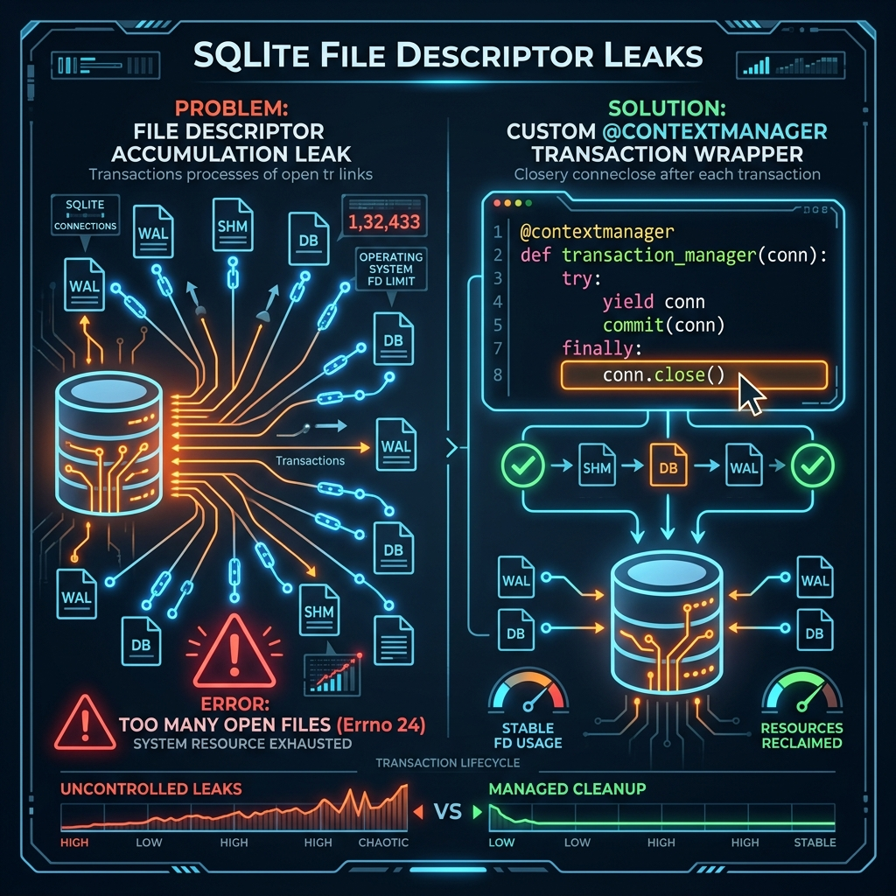

# Relatório técnico — Issue #69678 e PRs relacionados

**Data da análise:** 22 de julho de 2026  
**Repositório:** `NousResearch/hermes-agent`  
**Issue principal:** [#69678 — SQLite connections leaked in delivery, async delegation, and verification evidence ledgers](https://github.com/NousResearch/hermes-agent/issues/69678)  
**PR principal:** [#69681 — fix(gateway,tools,agent): close leaked SQLite connections in delivery](https://github.com/NousResearch/hermes-agent/pull/69681)

## Resumo executivo

A issue #69678 descreve um bug real: três ledgers SQLite usam a conexão como context manager, mas nunca a fecham explicitamente. Em processos de gateway de longa duração, as conexões e seus descritores de arquivo podem permanecer vivos até a coleta pelo garbage collector, acumulando descritores para o banco principal, `-wal` e `-shm`. O processo eventualmente pode atingir `RLIMIT_NOFILE` e começar a falhar com `[Errno 24] Too many open files` em componentes não relacionados.

A causa raiz apresentada está correta. O PR #69681 corrige os 21 call sites identificados e preserva as semânticas existentes de transação e locking.

**Conclusão:** #69678 não é duplicata exata de #69567. Ambas pertencem à mesma classe de bug, mas afetam módulos diferentes. O PR #69681 deve ser tratado como fix irmão do PR #69594, não como implementação duplicada.

## Escopo afetado

| Módulo | Call sites afetados | Operações que acionam o ledger | Risco |
|---|---:|---|---|
| `gateway/delivery_ledger.py` | 5 | Registro, atualização, recuperação, pruning e inspeção de entregas | Muito alto; executado no fluxo frequente de respostas finais |
| `tools/async_delegation.py` | 13 | Dispatch, conclusão, recuperação, claim, release e confirmação de entrega | Alto durante delegações em background |
| `agent/verification_evidence.py` | 3 | Resultado de terminal, edição do workspace e leitura de status | Cresce com operações de desenvolvimento e verificação |

Total confirmado: **21 call sites**.

## Causa raiz

Os módulos usam o seguinte padrão:

```python
with _connect() as conn:
    ...
```

O context manager de `sqlite3.Connection` controla a transação:

- sucesso: commit;
- exceção: rollback;
- saída do bloco: não executa `conn.close()`.

Consequentemente, o bloco `with` transmite uma falsa impressão de gerenciamento completo do recurso. A transação termina, mas o lifecycle da conexão não termina de forma determinística.

Em modo WAL, uma conexão pode manter descritores associados a:

- arquivo principal do banco;
- arquivo `-wal`;
- arquivo `-shm`.

Em processo curto, encerramento ou coleta rápida pode mascarar o defeito. Em gateway long-lived, sob tráfego recorrente, acúmulo pode alcançar o soft limit de descritores e causar falhas em leituras de configuração, arquivos temporários, sockets e outros bancos SQLite.

## Relação com #69567 e PR #69594

[Issue #69567](https://github.com/NousResearch/hermes-agent/issues/69567) encontrou a mesma falha em `cron/executions.py`. Uma execução normal de cron abre conexões em `create_execution()`, `mark_execution_running()` e `finish_execution()`. O relato mediu crescimento de descritores até atingir limite do processo.

[PR #69594](https://github.com/NousResearch/hermes-agent/pull/69594) propõe um `_transaction()` que:

1. abre a conexão;
2. preserva commit/rollback com `with conn:`;
3. fecha a conexão em `finally`;
4. fecha também quando inicialização de PRAGMA/schema falha.

O PR #69681 aplica o mesmo modelo a três ledgers não alterados pelo PR #69594.

### Decisão sobre duplicidade

**Não marcar #69678 como duplicata de #69567.**

Justificativa:

- causa técnica idêntica;
- arquivos e call paths diferentes;
- #69594 altera somente ledger de cron;
- mesmo após #69594, os 21 sites de #69678 continuariam vazando conexões;
- busca de PRs relacionados não encontrou outro PR cobrindo os três módulos de #69678.

Classificação correta: issues irmãs pertencentes à mesma classe de defeito.

## Avaliação do PR #69681

### Estado observado

- aberto;
- não é draft;
- GitHub o considera mergeable;
- 1 commit;
- 6 arquivos alterados;
- 512 adições e 29 remoções;
- sem reviews ou comentários no momento da análise.

### Solução implementada

Cada módulo recebe um context manager equivalente a:

```python
@contextmanager
def _transaction() -> Iterator[sqlite3.Connection]:
    conn = _connect()
    try:
        with conn:
            yield conn
    finally:
        conn.close()
```

Além disso, `_connect()` passa a fechar a conexão caso PRAGMA ou inicialização de schema falhe depois de `sqlite3.connect()` ter retornado com sucesso.

### Pontos corretos

- fechamento determinístico em sucesso, early return e exceção;
- commit e rollback continuam delegados ao context manager nativo;
- locking existente é preservado;
- `_transaction()` não adquire `_DB_LOCK`, evitando lock nesting novo;
- `_prune()` em `delivery_ledger` continua lock-free;
- contrato schema-on-connect é mantido;
- todos os 21 call sites são migrados;
- nenhuma configuração, schema de ferramenta ou superfície core nova é adicionada.

Nenhum defeito funcional foi identificado no patch analisado.

## Minimal fix recomendado

Solução do PR é pequena no comportamento de produção e resolve a causa raiz. Recomendação: manter `_transaction()` local em cada módulo.

Não criar agora um helper SQLite global compartilhado. Isso aumentaria escopo, acoplamento e risco para resolver três módulos independentes. Uma abstração compartilhada só deve surgir após demanda concreta e contrato comum comprovado.

Possíveis reduções sem mudar o desenho:

- encurtar docstrings repetidas dos três `_transaction()`;
- compartilhar fixture de tracking apenas se já existir local apropriado na suíte;
- evitar refatorações adjacentes.

O volume `+512/-29` vem principalmente dos três arquivos de regressão. O fix runtime em si permanece cirúrgico.

## Avaliação dos testes

O PR adiciona testes para:

- fechamento em operações normais;
- update sem linha correspondente;
- exceção durante operação SQL;
- falha durante inicialização do schema;
- igualdade entre número de conexões abertas e fechadas.

Os testes usam conexões SQLite reais envolvidas por um proxy que registra chamadas a `close()`. Isso valida diretamente o contrato quebrado e evita depender do timing do garbage collector.

### Melhoria opcional

Adicionar teste Linux de integração contando `/proc/self/fd` após várias operações. Esse teste reproduziria o sintoma externo, mas pode ser específico de plataforma e mais frágil. Não deve bloquear merge se a suíte direta de lifecycle e suítes existentes estiverem verdes.

Resultados citados pelo autor não foram reexecutados nesta análise, pois checkout local contém várias alterações pré-existentes e branch do PR não foi aplicada. Antes do merge, CI deve confirmar:

```text
tests/gateway/test_delivery_ledger_fd_leak.py
tests/tools/test_async_delegation_fd_leak.py
tests/agent/test_verification_evidence_fd_leak.py
tests/gateway/test_delivery_ledger.py
tests/gateway/test_delivery_ledger_producer.py
tests/tools/test_async_delegation.py
tests/agent/test_verification_evidence.py
```

## Issues relacionadas

Mesma classe geral de lifecycle SQLite, mas escopos diferentes:

- [#69567](https://github.com/NousResearch/hermes-agent/issues/69567): cron execution ledger;
- [#60859](https://github.com/NousResearch/hermes-agent/issues/60859): leak de `SessionDB` em early return;
- [#30027](https://github.com/NousResearch/hermes-agent/issues/30027): listagem de boards kanban;
- [#28802](https://github.com/NousResearch/hermes-agent/issues/28802): helpers kanban specify;
- [#36111](https://github.com/NousResearch/hermes-agent/issues/36111): lifecycle de `ResponseStore` no API server;
- [#37369](https://github.com/NousResearch/hermes-agent/issues/37369): crescimento de descritores de `response_store.db`.

Essas issues demonstram padrão recorrente: uso de context manager transacional interpretado incorretamente como gerenciamento completo da conexão.

## Possíveis ocorrências residuais

Busca estática encontrou padrões semelhantes fora do escopo do PR, incluindo:

- `gateway/readiness.py`;
- templates FastMCP em `optional-skills/mcp/fastmcp/templates/database_server.py`.

Esses locais não devem ser incluídos automaticamente em #69681. Cada ocorrência precisa de:

1. confirmação de que conexão não possui outro owner;
2. reprodução ou teste de lifecycle;
3. análise da frequência e duração do processo;
4. fix separado quando comportamento estiver comprovado.

Expandir #69681 para uma auditoria global contrariaria objetivo de mudança cirúrgica.

## Solução estrutural futura

Após merge dos fixes urgentes, abrir tarefa separada de auditoria dirigida:

1. localizar `with sqlite3.connect(...)`, `with connect(...)` e `with _connect(...)`;
2. classificar conexões por lifecycle: per-operation ou long-lived;
3. exigir `contextlib.closing`, `try/finally close()` ou helper transacional para conexões per-operation;
4. adicionar teste de regressão somente para call paths reais;
5. documentar em guia interno que `sqlite3.Connection` context manager não fecha a conexão.

Evitar mudança mecânica global: alguns componentes podem manter conexão deliberadamente durante lifetime do serviço.

## Recomendação final

1. Não fechar #69678 como duplicata.
2. Tratar #69594 e #69681 como fixes irmãos.
3. Aprovar desenho do PR #69681 após CI verde.
4. Não ampliar PR para ocorrências não reproduzidas.
5. Criar follow-up separado para auditoria de lifecycle SQLite no repositório.

**Decisão sugerida:** merge do PR #69681 após validação automática e review, seguido pelo fechamento da issue #69678 como concluída.

---

## 📊 Infográfico: Vazamento de FDs e Correção



